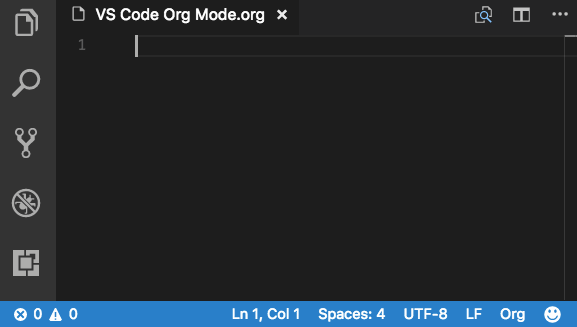
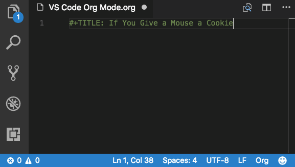
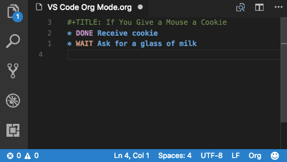
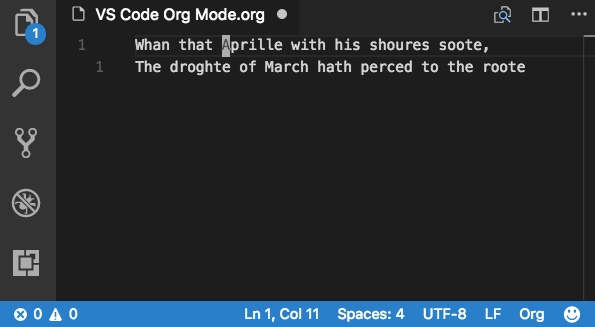
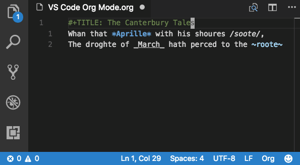

# VS Code Org Mode

VS Code Org Mode is an extension for Visual Studio Code inspired by the venerable [Org mode for Emacs](http://orgmode.org/). Org lets you keep notes, maintain TODO lists, and author documents, all in plain text.

The extension is currently in alpha. We welcome issues, feature requests, and contributions to the [repo](https://github.com/jsonreeder/vscode-org-mode).

## How to

The extension can be activated in two ways:
1. Save a file with the extension `.org`
2. Change the language mode to `Org` by either
    - Clicking in the lower right corner to the left of the smiley face
    - Typing `change language mode` into the command palette
    - Using the default shortcut
        - Linux / Windows: <kbd>ctrl</kbd>+<kbd>k</kbd> <kbd>m</kbd>
        - Mac: <kbd>cmd</kbd>+<kbd>k</kbd> <kbd>m</kbd>

## Features

# VS Code Org Mode

**VS Code Org Mode** is an extension for [Visual Studio Code](https://code.visualstudio.com/) inspired by the venerable [Org mode for Emacs](http://orgmode.org/).

Org lets you keep notes, maintain TODO lists, and author documents, all in plain text.

## Features

### Keep Notes

Create outlines:



Promote and demote items:


### Maintain TODO Lists

Create TODOs:



Change TODO status:


Customize your TODO Keywords:


Insert timestamps:



Modify dates:


### Author Documents

Style your text:



Add metadata with a snippet:


Add links with a snippet:



Add comments:


## Get it

Find Org Mode on the [VS Code Marketplace](https://marketplace.visualstudio.com/items?itemName=tootone.org-mode):


## Learn More

Learn more on the project's repository ([vscode-org-mode](https://github.com/jsonreeder/vscode-org-mode)) and the [complete documentation](https://github.com/jsonreeder/vscode-org-mode/wiki):


VS Code Org Mode is an open-source project. We welcome contributions and feature requests. See the repo for contribution guidelines.

### Snippets

The extension comes preloaded with a few snippets (try typing `link` and hitting <kbd>tab</kbd>, for example).

## Settings

### Keybindings

All actions in VS Code Org mode come packaged with default keybindings. These can be modified in your `keybindings.json` file.

### Custom TODO Keywords

TODO keywords can be customized in `settings.json`. For example:
```json
"org.todoKeywords": [
    "TODO",
    "DONE",
    "WAIT",
    "SCHD"
]
```

## Docs

Detailed documentation is kept in the [GitHub Wiki](https://github.com/jsonreeder/vscode-org-mode/wiki).

## Contributing

We welcome contributions to the GitHub repo. Here are basic guidelines for conventions.

### Naming

The full name of this project is `VS Code Org Mode`. It is abbreviated `vscode-org-mode`. In the VS Code Marketplace, it is listed as `Org Mode`.

Commands are prefixed with `org.` and followed by camel case, eg `org.insertHeadingRespectContent`. Command titles are prefixed with `Org: ` and followed by capitalized words separated by spaces, eg `Org: Insert Heading Respect Content`.

Filenames use kebab case, eg `header-functions.ts`.

When referring to the original Org mode, we capitalize the "O" and leave the "m" lower case. This is in keeping with the original team's usage on [orgmode.org](http://orgmode.org/).

### Code

Use TSLint with default settings.

### Git

- `master` is used for production deploys.
- `develop` is the main branch into which new features are merged. It is protected from direct pushes, so all changes come from pull requests.
- Features: For all new additions, create a new feature branch. When complete, create a pull request into `develop` for that branch. Optionally, prefix feature branch names with `feature/`.

## Gratitude

The original Org mode was written for Emacs by Carsten Dominik, with the help and support of [an impressive list of geniuses](http://orgmode.org/org.html#History-and-Acknowledgments). Our work is inspired by though not associated with their original masterpiece. In addition, many aspects of the extension were inspired by [the Spacemacs Org layer](https://github.com/syl20bnr/spacemacs/tree/master/layers/%2Bemacs/org).


Our unicorn icon is based on an image by [M. Turan Ercan](https://thenounproject.com/mte/) for [the Noun Project](https://thenounproject.com/). We're grateful to them for making the image available under the Creative Commons license.

## License

This work is available under the [GNU General Public License v3](https://www.gnu.org/licenses/gpl-3.0.en.html).

## Requirements

Install the extension. The rest will be taken care of.

## Known Issues

### Folding

VS Code's folding strategy is based on indentation. There is no indentation in Org. There are a number of feature requests to allow for header-level folding:
- [language-aware folding #3422](https://github.com/Microsoft/vscode/issues/3422)
- [Add code folding for markdown based on heading level #3347](https://github.com/Microsoft/vscode/issues/3347)

Until Microsoft addresses those issues, it appears to be impossible to implement folding in Org.

### Colorization

Colorization, bolding, italicization, and other modes of highlighting are handled differently by different themes. We have prioritized supporting the default VS Code themes (Dark+ and Light+). This prioritization means that some colors may not appear as expected in other themes, or that opportunities for more variance have been missed.

## Release Notes

See [CHANGELOG.md](https://github.com/jsonreeder/vscode-org-mode/blob/develop/CHANGELOG.md).
